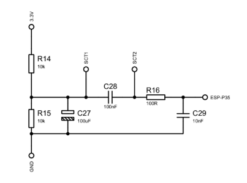

# Biblioteca SCT013XX para ESP32

Esta biblioteca foi desenvolvida para resolver problemas críticos de leitura de corrente AC com sensores **SCT-013** (não invasivos) em microcontroladores **ESP32**, focando especialmente em circuitos com divisores de tensão personalizados onde o "Zero Virtual" (Offset DC) não é exato.

---

## ⚠️ O Problema (Motivação)

A maioria das bibliotecas padrão (como EmonLib) foi projetada para Arduino UNO (5V) e assume cenários ideais que não se aplicam ao ESP32:

* **Offset DC Incorreto:** Em circuitos de 3.3V, o ponto médio teórico é 1.65V. Porém, resistores reais têm tolerância, fazendo o zero real ser 1.54V, 1.58V, etc. Isso gera leituras falsas.
* **Sensores com Tensão de Saída:** Alguns modelos (ex: SCT-013-050 1V) já possuem resistor de carga interno, o que confunde bibliotecas que esperam apenas corrente.
* **Ruído:** O ADC do ESP32 não é linear, gerando leituras "fantasmas" (0.2A, 0.5A) mesmo com o motor desligado.

---

## 🔌 Hardware Recomendado (Esquema)

Para garantir leituras estáveis e sem ruído, recomenda-se a utilização do circuito abaixo, que inclui polarização DC e filtragem de ruído (Filtro RC) na entrada do microcontrolador.



> **Nota:** O circuito acima inclui um **Filtro Passa-Baixa (R16 + C29)** essencial para limpar o ruído digital do ESP32.

**Descrição dos Componentes:**
* **Divisor de Tensão (Offset DC):**
    * `R14` e `R15` (10kΩ): Criam o ponto central de tensão (aprox. 1.65V).
    * `C27` (100uF): Capacitor eletrolítico para estabilizar a tensão DC.
* **Acoplamento do Sensor:**
    * `C28` (100nF): Capacitor cerâmico para isolar o DC e permitir a passagem apenas do sinal AC do sensor.
* **Filtro Passa-Baixa (Anti-Ruído):**
    * `R16` (100R) e `C29` (10nF): Formam um filtro RC passivo logo na entrada do pino (ESP-P35) para eliminar frequências altas e interferências eletromagnéticas.

---

## ✅ A Solução (Funcionalidades)

Esta biblioteca implementa um algoritmo RMS (*Root Mean Square*) otimizado que permite controle total sobre a matemática da leitura:

1.  **Ajuste Fino do Zero (MidRail):** Você define exatamente qual é a tensão DC do seu circuito (ex: `1.5492V`) em vez de usar um valor fixo.
2.  **Fator de Calibração Universal:** Permite definir a corrente nominal exata do sensor.
3.  **Noise Gate (Corte):** Define um valor mínimo (ex: `1.0A`). Qualquer leitura abaixo disso é considerada ruído e zerada via software.

---

## 🚀 Como Usar

### 1. Instalação
1.  Baixe este repositório clicando em **Code > Download ZIP**.
2.  Na IDE do Arduino, vá em: **Sketch -> Incluir Biblioteca -> Adicionar biblioteca .ZIP**.
3.  Selecione o arquivo baixado.

### 2. Exemplo Básico (Leitura de Corrente)

```cpp
#include <SCT013XX.h>

#define PINO_SENSOR 35 

SCT013XX sensor(PINO_SENSOR);

void setup() {
  Serial.begin(115200);
  sensor.begin();

  // Configuração: (Vref, ADC_Bits, MidRail_Volts, Fator_Calibracao, Noise_Gate)
  // Use o "Sketch de Calibração" abaixo para encontrar o valor exato do MidRail
  sensor.configurar(3.3, 4095.0, 1.5492, 50.0, 0.5);
}

void loop() {
  // Lê 2000 amostras
  double amperagem = sensor.calcular(2000);
  
  Serial.print("Corrente: ");
  Serial.print(amperagem);
  Serial.println(" A");
  
  delay(500);
}
````

-----

## 🧠 Entendendo os Parâmetros

Para que servem os números dentro do `sensor.configurar`?

### 1\. Fator de Calibração (Corrente do Sensor)

É literalmente a corrente nominal do seu sensor.

  * **Como configurar:** Basta olhar o que está escrito no corpo do sensor.
      * Se o sensor é de **50A**, coloque `50.0`.
      * Se o sensor é de **100A**, coloque `100.0`.
      * Se o sensor é de **30A**, coloque `30.0`.

### 2\. Noise Gate (O "Filtro de Ruído")

É um portão de corte. O ESP32 é muito sensível e capta interferências elétricas do ambiente, mostrando correntes "fantasmas" (ex: `0.20A`) mesmo com tudo desligado.

  * **O que ele faz:** Se você definir o Gate como `0.5`, a biblioteca vai ignorar qualquer leitura abaixo de 0.5A e mostrará `0.00A`, deixando o display limpo quando o motor estiver parado.

-----

## 🔧 Ferramenta de Calibração (Hardware)

Use este código para descobrir a tensão exata do seu "Zero Virtual" (MidRail) antes de configurar o código principal.

**Passo a passo:**

1.  Carregue este código no ESP32.
2.  Mantenha o sensor conectado (com o circuito montado), mas **sem passar nenhum fio/carga dentro dele**.
3.  Abra o Serial Monitor. O valor que aparecer é o seu `MidRail`.

<!-- end list -->

```cpp
// Sketch para descobrir o Zero Virtual (MidRail)
#define PINO_SENSOR 35 

void setup() {
  Serial.begin(115200);
  pinMode(PINO_SENSOR, INPUT);
}

void loop() {
  long soma = 0;
  // Tira uma média de 5000 leituras para estabilidade
  for(int i=0; i<5000; i++){
    soma += analogRead(PINO_SENSOR);
  }
  float mediaADC = soma / 5000.0;
  
  // Converte para tensão (Considerando ESP32 3.3V e 12 bits)
  float voltagemZero = mediaADC * (3.3 / 4095.0);

  Serial.print("Leitura ADC: ");
  Serial.print(mediaADC);
  Serial.print(" | MidRail (Use este valor): ");
  Serial.println(voltagemZero, 4); // 4 casas decimais para precisão
  
  delay(1000);
}
```

-----

## 🛠️ Guia de Ajuste Fino

Para obter precisão máxima:

1.  **Ajuste do Fator:** Ligue uma carga conhecida. Se o valor lido não bater exato (devido à tolerância dos componentes), faça um ajuste fino no valor.
      * Ex: Sensor de 50A lendo um pouco menos? Mude o Fator de `50.0` para `50.5` ou `51.0`.
2.  **Ajuste do Noise Gate:** Desligue a carga.
      * Se o Serial fica oscilando (ex: `0.15A`, `0.08A`), defina o Noise Gate um pouco acima (ex: `0.25`).

-----

## 📋 Compatibilidade

| Placa | Tensão (Vref) | Resolução (ADC) | Nota |
| :--- | :---: | :---: | :--- |
| **ESP32** | 3.3V | 4095 | ✅ Recomendado |
| Arduino Uno | 5.0V | 1023 | Funciona (ajustar parâmetros) |
| Arduino Mega | 5.0V | 1023 | Funciona (ajustar parâmetros) |

### Sensores Suportados:

Use o valor da corrente máxima do sensor como Fator de Calibração:

  * **SCT-013-005** -\> Fator: `5.0`
  * **SCT-013-010** -\> Fator: `10.0`
  * **SCT-013-020** -\> Fator: `20.0`
  * **SCT-013-030** -\> Fator: `30.0`
  * **SCT-013-050** -\> Fator: `50.0`
  * **SCT-013-060** -\> Fator: `60.0`
  * **SCT-013-100** -\> Fator: `100.0`

-----

## 🎓 Autoria

> Desenvolvido por **Lucas Santos Gama** como parte do Trabalho de Conclusão de Curso (TCC) em Eletroeletrônica - **SENAI Mariano Ferraz** (2025).

```
```

